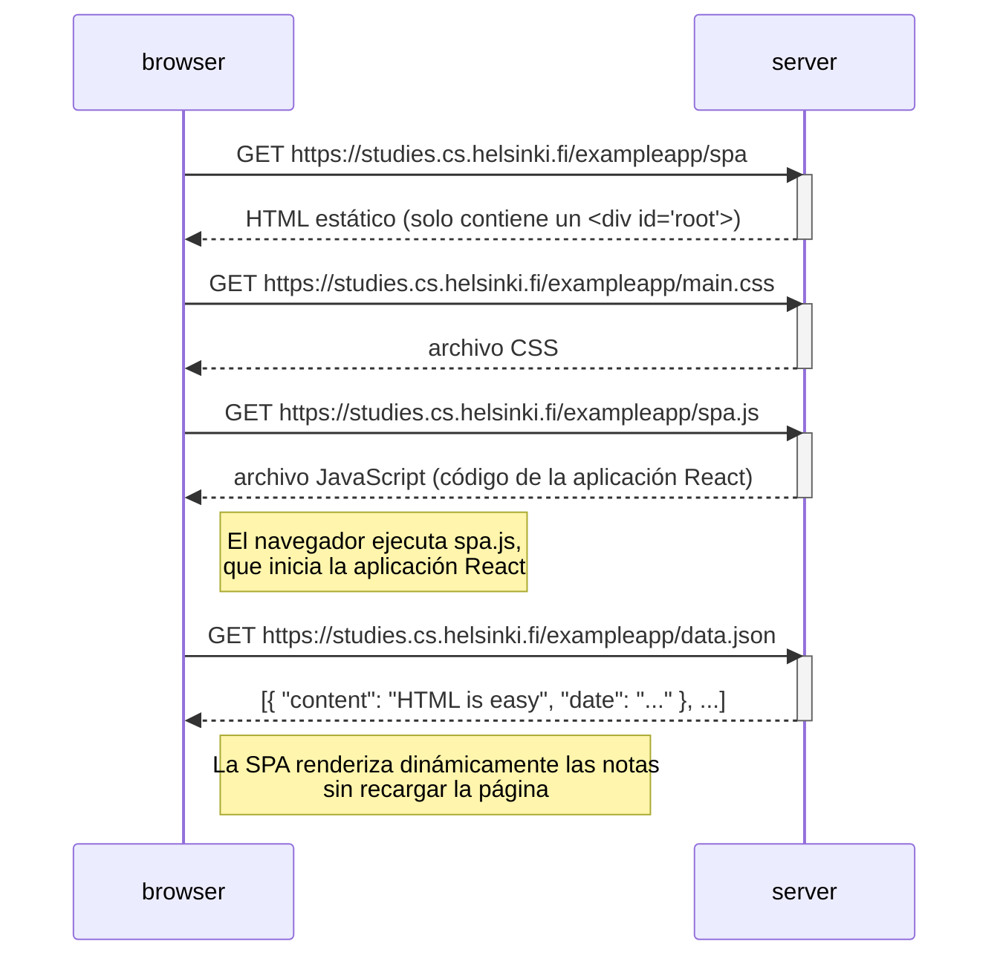

```mermaid
sequenceDiagram
    participant browser
    participant server

    browser->>server: GET https://studies.cs.helsinki.fi/exampleapp/spa
    activate server
    server-->>browser: HTML estático (solo contiene un <div id="root">)
    deactivate server

    browser->>server: GET https://studies.cs.helsinki.fi/exampleapp/main.css
    activate server
    server-->>browser: archivo CSS
    deactivate server

    browser->>server: GET https://studies.cs.helsinki.fi/exampleapp/spa.js
    activate server
    server-->>browser: archivo JavaScript (código de la aplicación React)
    deactivate server

    Note right of browser: El navegador ejecuta spa.js,<br/>que inicia la aplicación React

    browser->>server: GET https://studies.cs.helsinki.fi/exampleapp/data.json
    activate server
    server-->>browser: [{ "content": "HTML is easy", "date": "..." }, ...]
    deactivate server

    Note right of browser: La SPA renderiza dinámicamente las notas<br/>sin recargar la página
```