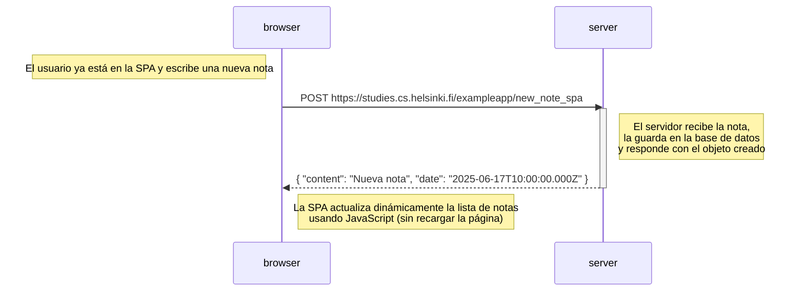

```mermaid
sequenceDiagram
    participant browser
    participant server

    Note left of browser: El usuario ya está en la SPA y escribe una nueva nota

    browser->>server: POST https://studies.cs.helsinki.fi/exampleapp/new_note_spa
    activate server
    Note right of server: El servidor recibe la nota,<br/>la guarda en la base de datos<br/>y responde con el objeto creado
    server-->>browser: { "content": "Nueva nota", "date": "2025-06-17T10:00:00.000Z" }
    deactivate server

    Note right of browser: La SPA actualiza dinámicamente la lista de notas<br/>usando JavaScript (sin recargar la página)
```